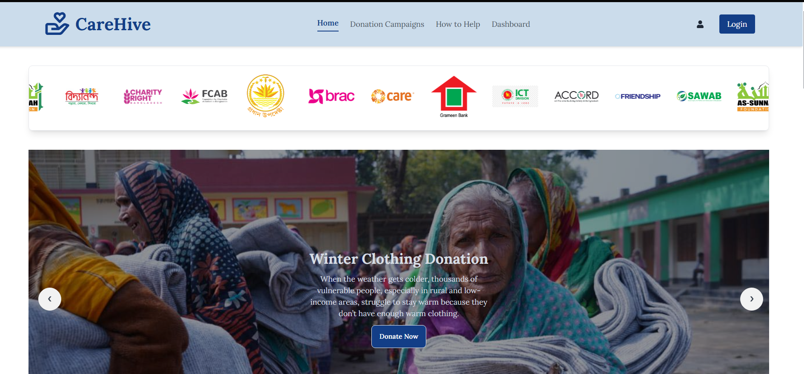
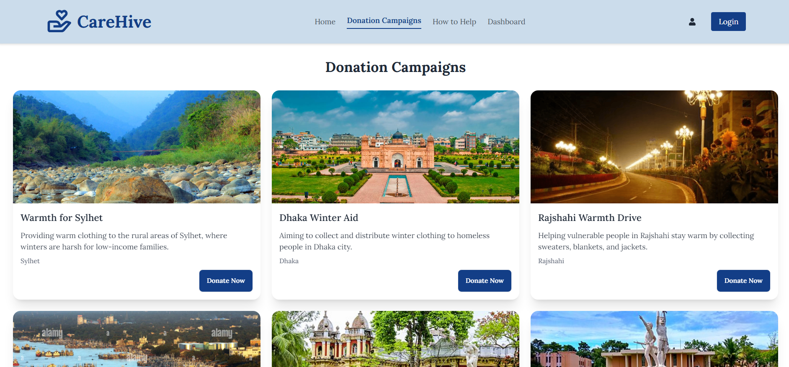
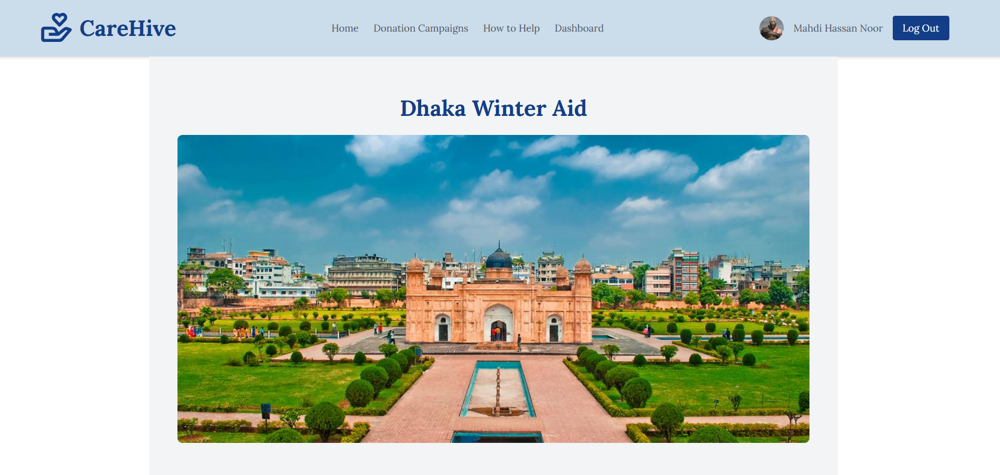
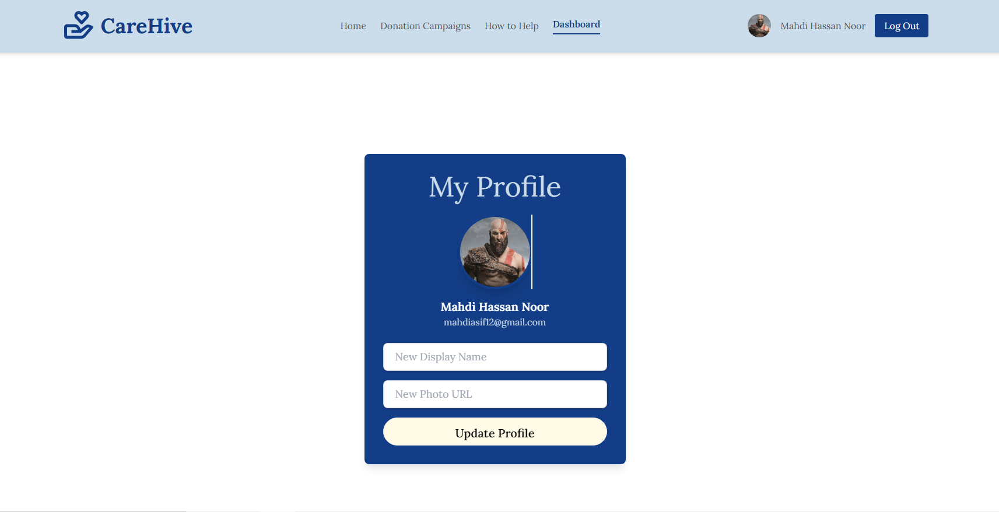

# **Winter Clothing Donation Website**

Welcome to the **Winter Clothing Donation Website**, a platform designed to connect donors with volunteers to provide winter clothing to those in need across Bangladesh. With a mission to bring warmth and comfort during the colder months, this platform makes donating simple, impactful, and accessible.

### 🌐 **Live Site URL**  
https://clothing-donation-d23d4.web.app/

---

## **Features and Highlights**
1. **Winter-Themed Responsive Design**  
   A visually appealing, division-focused winter theme optimized for mobile, tablet, and desktop devices.

2. **Donation Campaigns Overview**  
   Browse all active campaigns with details such as title, description, division, and status. Each campaign includes a "Donate Now" option for easy participation.

3. **Donation Details (Private Access)**  
   Secure access to campaign details with a donation form to submit item type, quantity, pickup location, and additional notes.

4. **Secure Authentication System**  
   User-friendly login and registration with Google Sign-In for seamless access. Private routes ensure authenticated users can explore exclusive features.

5. **Dynamic User Dashboard**  
   Personalized dashboard displaying user profile information with options to update name and profile picture.

6. **404 Error Page**  
   A custom-designed "Not Found" page to guide users back to the homepage.

7. **Interactive Animations**  
   Enhanced user experience with AOS animations across the site.

---

## **How to Use**
1. Visit the live site using the link above.  
2. Navigate through donation campaigns to explore active drives.  
3. Log in or register to access private routes like the donation details and user dashboard.  
4. Fill out the donation form to contribute winter clothing items.  
5. Update your profile to personalize your experience.

---

## **Technical Overview**
 **Technology Stack**  
   - **Frontend**: React, TailwindCSS, DaisyUI  
   - **Authentication**: Firebase Authentication  
   - **Data Handling**: Dynamic JSON-based campaign data  
   - **Hosting**: Netlify / Firebase Hosting

 **Key Functionalities**  
   - Private routing for secured user access.  
   - Firebase-powered login, registration, and Google authentication.  
   - Dynamic campaign display from JSON data.  

  

